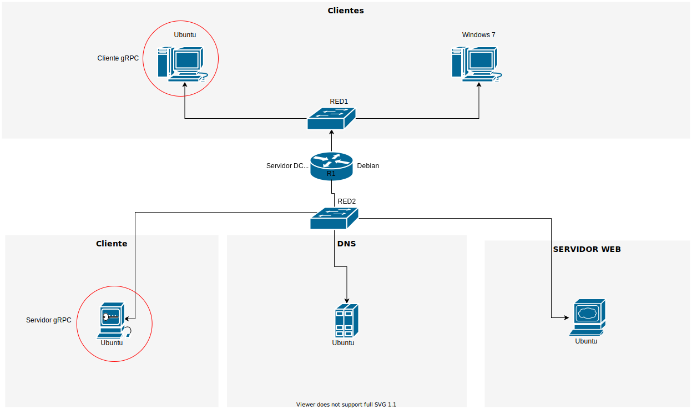
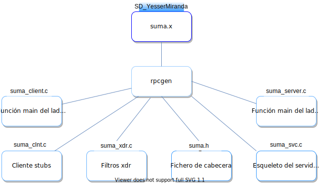

# Tutorial de RPC en C


Siguiendo la topología creada en la asignación [práctica de redes de máquinas virtuales](Practica1_EntornoDeMaquinasVirtuales.md) 
## RPCGEN  
Es un pre-compilador generador de interfaces en C desarrollado por Sun. A partir de una especificación se crea código en C que permite inicializar un cliente y servidor.
<br>

## Prerrequisitos
Antes de poder seguir este tutorial, debe tener lo siguiente instalado en su sistema:
### Herramientas necesarias
- SUN **RPCGEN**:
- Compilador **GCC**
- Ubuntu Linux
### Instrucciones de instalación
```sh
$ sudo apt-get update
$ sudo apt-get install build-essential
$ sudo apt-get install rpcgen
$ sudo apt-get install rpcbind
```
Prueba si ya esta instalado *gcc* y *rpcgen*
```sh
$ gcc
$ clang: error: no input file
$ rpcgen 
$ ...
$ /* una lista larga de comandos.... */
$ ...
```
### Probar el resultado del ejemplo
Si decide probar el resultado de la actividad, puede acceder al directorio [RPC-C](RPC-C/) y compilar usando el siguiente comando: 
```sh
$ cd RPC-C
$ make -f ./Makefile.suma
```
#### Probar el resultado en una sola máquina
Puede probar la funcionalidad ejecutando los ficheros generados de `suma_client` y `suma_server`.
* Abra una terminal y ejecute
```sh
$ ./suma_server
```
* Lance otra terminal y ejecute
```sh
$ ./suma_client localhost 5 7
```
Debería obtener como resultado 
```sh
resultado = 12
```
Es recomendable que realice la construcción de este ejemplo y vaya indagando sobre las dudas presentadas, para eso, continue con la actividad.
<br>

## Actividad: Mi primer programa con RPC
* Crea una aplicación distribuida usando **RPCGEN**.
* Conoce el proceso de distribución de aplicaciones en general para abordar situaciones más complejas.
### Crear la interfaz que define el RPC

Dentro de la carpeta de este repositorio se encuentra encuentra el fichero [suma.x](RPC-C/suma.x). Revise su estructura. Es importante tener en cuenta que a estos ficheros se les conoce como **Interface Description Language (IDL)**. Describe la interfaz con la que se comunicarán cliente y servidor.  

Puedes crear un directorio para contener el resultado generado
```sh
$ mkdir ~/rpcgen
$ cd ~/rpcgen
$ nano suma.x
```
Dentro del editor va el siguiente código
```c
struct intpair {
        int a;
        int b;
};

program SUMA_PROG{
        version SUMA_VERS {
                int SUMA(intpair) = 1;
        } = 1;
} = 0x23451111;
```

### Generar el código del cliente y servidor
Tomando como base el fichero `suma.x` utilice el comando `rpcgen` para generar la estructura base del cliente y servidor
```sh
$ rpcgen -a -C suma.x
```
  

La bandera -C (mayúscula) le dice a **rpcgen** que genere código C bajo la norma ANSI y la bandera -a (minúscula) nos indica que se generarán todos los archivos de código fuente (incluido código de ejemplo)  

A continuación, se revisarán los ficheros generados:

##### suma.h
En este fichero encontramos declaración que será usado tanto en el cliente como en el servidor
```c
#include <rpc/rpc.h>

struct intpair {
	int a;
	int b;
};

#define SUMA_PROG ((rpc_uint)0x23451111)
#define SUMA_VERS ((rpc_uint)1)
#define SUMA ((rpc_uint)1)

extern  bool_t xdr_intpair(XDR *, intpair*); /* boolean to test consistency of struct */
extern  int *suma_1(intpair *, CLIENT *); /* client stub interface */
extern  int *suma_1_svc(intpair *, struct svc_req *); /* server remote procedure */
```

##### suma_client.c
Este fichero contiene la función main del lado del cliente, toma como argumento la dirección IP del servidor (server_host).
```c
#include "suma.h"

int *
suma_1_svc(intpair *argp, struct svc_req *rqstp)
{
	static int  result;
	/*
	 * insert server code here
	 */

	return &result;
}
```
##### suma_clnt.c
Esta es la función stub del cliente que implementa la función **suma_1**, serializa el parámetro, llama al procedimiento remoto, y devuelve el resultado. Todo ello mediante el procedimiento *clnt_call*.
```c
// ...
suma_1(intpair *argp, CLIENT *clnt)
{
	static int clnt_res;

	memset((char *)&clnt_res, 0, sizeof(clnt_res));
	if (clnt_call (clnt, SUMA,
		(xdrproc_t) xdr_intpair, (caddr_t) argp,
		(xdrproc_t) xdr_int, (caddr_t) &clnt_res,
		TIMEOUT) != RPC_SUCCESS) {
		return (NULL);
	}
	return (&clnt_res);
}
```
##### suma_svc.c
Este es el programa servidor. Si nos fijamos en el código, verás que implementa el procedimiento principal (la función *main*), y es aquí en donde se registra el servicio.
```c
int main( int argc, char* argv[] )
{
...
	if (!svc_register(transp, SUMA_PROG, SUMA_VERS, suma_prog_1, proto)) {
	   _msgout("unable to register (SUMA_PROG, SUMA_VERS, udp).");
	   exit(1);
	}
...
```
##### suma_xdr.c
No siempre se genera depende de los parámetros utilizados para procedimientos remotos. Este archivo contiene código para reunir parámetros para la estructura intpair.
##### suma_server.c
Aquí agregaremos el código necesario para implementar el procedimiento remoto
#### Primera prueba a nuestro servidor
Modificamos el archivo **suma_server.c**, localizamos la línea en donde se menciona *"Insert server code here"* y agregamos lo siguiente:
```c
/*
 * insert server code here
 */
printf("El procedimiento ha sido invocado remotamente\n");
```
Este mensaje nos permitirá saber cuando el servidor reciba un mensaje desde algún cliente.  
Antes de compilar debemos hacer algunas modificaciones al fichero **Makefile.suma** principalmente por que deseamos que el proceso del servidor se ejecute en segundo plano y además asegurar que el código generado corresponda a **ANSI-C**.
De este modo, le indicamos a **RPCGEN** que ejecute en segundo plano:
```sh
CFLAGS += -g
```
**Cambiarlo a:**
```sh
CFLAGS += -g -DRPC_SVC_FG
```
Nos aseguramos que **RPCGEN** genere código ANSI-C:
```sh
RPCGENFLAGS =
```
**Cambiarlo a:**
```sh
RPCGENFLAGS = -C
```
A continuación ejecutamos **Makefile.suma** esto nos compilará todo el código de nuestro proyecto usando el compilador de **C**.
```sh
$ make -f ./Makefile.suma
```
Para nuestro caso inicializaremos un servidor en nuestra misma computadora, ejecutamos suma_server con permisos de administrador:
```sh
$ sudo ./suma_server
```
Abrimos una nueva terminal en una nueva pestaña ó ventana y ahora ejecutaremos al cliente y especificamos el lugar en donde se encuentra nuestro servidor:
```sh
$ ./suma_client localhost
```
Si revisamos la terminal en donde se encuentra ejecutándose el proceso del servidor podremos ver el mensaje **"El procedimiento ha sido invocado remotamente..."**, con esto podemos confirmar que la comunicación entre el cliente y el servidor es satisfactoria y estamos llamando remotamente a nuestro proceso.  
Si quisieramos llamar el proceso desde otra computadora tendríamos que especificar la ubicación del servidor (ej. 192.168.2.4) en lugar de **"localhost"**.
<br>

## Modificaciones adicionales
Localizamos el fichero suma_client.c y modificamos la función suma_prog_1 para que acepte dos parámetros:
```c
void
suma_prog_1(char *host, int a, int b)
``` 
Asignamos estos parámetros a las variables del proceso remoto en:
```c
suma_1_arg.a = a;
suma_1_arg.b = b;
result_1 = suma_1(&suma_1_arg, clnt);
```
Antes de compilar no olvidemos añadir la librería **stdio.h** al inicio del archivo.  
```c
#include <stdio.h>
```
Debemos hacer los cambios correspondientes en la función **main**, debería verse así:
```c
int
main(int argc, char *argv[]) {
        char *host;
        int a, b;
        if (argc != 4) {
            printf ("usage: %s server_host num1 num2\n", argv[0]);
            exit(1);
        }
        host = argv[1];
        if ((a = atoi(argv[2])) == 0 && *argv[2] != '0') {
            fprintf(stderr, "invalid value: %s\n", argv[2]);
            exit(1);
        }
        if ((b = atoi(argv[3])) == 0 && *argv[3] != '0') {
            fprintf(stderr, "invalid value: %s\n", argv[3]);
            exit(1);
        }
        suma_prog_1(host, a, b);
}
```
Compilar con **make**, ejecutar el **servidor** y **cliente** nuevamente. Ahora el cliente si lo ejecutamos de este modo:
```sh
./suma_client localhost 5 7
```
Debería mostrar:
```sh
result = 12
```
## Comunicación a través de la red
Es momento de trasladar el cliente a través de la red, debido a que a las máquinas se encuentran en una red local sin acceso a internet, entonces, se le recomienda cambiar a interfaz NAT en la configuración de la máquina en Virtual Box, para que pueda descargar **ssh**.
```sh
$ apt-get update
$ apt-get install openssh-server openssh-client
```
Utilizaremos ssh desde una máquina para conectarnos a otra, usando la shell segura, suponiendo que se desea conectar de una máquina A cliente con IP=192.168.1.2 a una máquina B servidor con IP=192.168.2.4, utilice los siguientes comandos para conectarse y copiar el fichero ejecutable.
```sh
$ ssh yesser@192.168.2.4
$ password para el usuario: 
$ scp suma_client yesser@192.168.1.2:/home/yesser/
$ password para el usuario
```
Estos comandos deben permitir conectar entre las dos máquinas y copiar el fichero correspondiente. Ahora, procedemos a ejecutar el cliente desde una máquina remota, teniendo en cuenta que el servidor tiene la IP=192.168.2.4:
```sh
$ ./suma_client 192.168.2.4 5 7
```