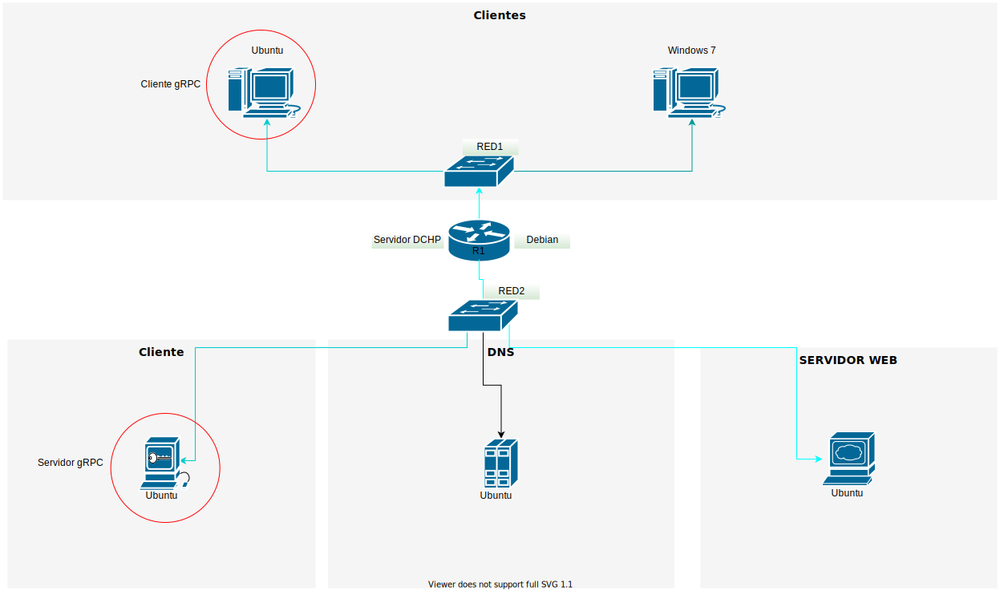

# Tutorial de gRPC en Go


Siguiendo la topología creada en la asignación [práctica de redes de máquinas virtuales](Practica1_EntornoDeMaquinasVirtuales.md) 
<br>

## Prerequisitos
Antes de poder seguir este tutorial, debe tener lo siguiente instalado en su sistema:
- **Go**: Versión 1.14 o superior. 
 Para obtener instrucciones de instalación, consulte La documentación de Go [Descarga e instalación](https://golang.org/doc/install "Download and install").

- **Protocol Buffer**: Versión 3.
Para obtener instrucciones de instalación, consulte la instalación de [Potocol Buffer](https://grpc.io/docs/protoc-installation/ "Potocol Buffer Installation") de gRPC o a la página de [Protocol Buffer](https://developers.google.com/protocol-buffers "Protocol Buffer").
<br>

## Ejecutar el ejemplo
Para ejecutar el ejemplo, descargue el código y vaya al directorio contenedor..

Primero inicie el servidor grpc con:

`$ go run sever/server.go`

Esto iniciará el servidor grpc escuchando en el puerto 9000

A continuación, ejecute el cliente grpc con:

`$ go run client/client.go`

Verá la siguiente salida:

```
2021/03/07 15:04:39 Respuesta del servidor: Hola gRPC Client desde el servidor!
```

y en el servidor verá: 

```
gRPC Server
El servidor gRPC ahora escucha en el puerto 9000
2021/03/07 15:04:39 Mensaje recibido de: gRPC Client
```
<br>

## Construyendo el ejemplo

Primero tenemos que inicializar los módulos go, utilizar cualquier nombre que desee, en este caso vamos a utilizar "grpcTutorial":

`$ go mod init grpcTutorial`

<br>

#### Plugins de Go para el Protocol Compiler

Necesitamos instalar los próximos plugins go para el protocol compiler y gRPC

Antes de instalar habilitamos el modo de módulo con:

`$ export GO111MODULE=on`

A continuación, instale lo siguiente: 

1. Instalar protoc-gen-go

	`$ go get google.golang.org/protobuf/cmd/protoc-gen-go`

2. Instalar protoc-gen-go-grpc

	`$ go get google.golang.org/grpc/cmd/protoc-gen-go-grpc `

3. Instalar grpc

	`$ go get google.golang.org/grpc`
	
<br>

Por último, actualiza tu `PATH` para que el `protoc` pueda encontrar los plugins:

`$ export PATH="$PATH:$(go env GOPATH)/bin"`

<br>

### Definir un servicios gRPC

Primero tenemos que definir el servicio gRPC y los tipos de solicitud y respuesta mediante búferes de protocolo.
<br>

#### Crear el archivo .proto 

Crear un archivo llamado `chat.proto`:

```go
// Definición de la versión de protocolo
syntax = "proto3";

// Definición del paquete
package chat;

// Definición del mensaje a enviar y recibir
message MessageRequest {
	string name = 1;
}

message MessageReply {
	string body = 1;
}

// Definición del ChatService
service ChatService {
	// Recibe un mensaje y devuelve un mensaje
	rpc SendMessage(MessageRequest) returns (MessageReply) {}
}
```

<br>

#### Generar código gRPC
Crear un nuevo directorio llamado `chatserver`,  este contendrá el código generado por `protoc`

`$ mkdir chatserver`


Para poder usar el servicio, necesita compilar el archivo `.proto`, lo hacemos usando` protocol` con el siguiente comando:

``$ protoc --go-grpc_out=require_unimplemented_servers=false:./chatserver/ --go_out=./chatserver/ chat.proto``

Esto generará `chat.pb.go` y `chat_grpc.pb.go` que son utilizados por el servidor grpc.

<br>

### Crear un servidor gRPC

Dentro de `chatserver` crear un nuevo fichero llamado `chat.go`

`touch chatserver/chat.go`

En este archivo implementaremos los servicios que definimos previamente en el fichero `chat.proto`:

```go
// Definición del paquete Chat
package chat

// Importaciones
import (
	"context"
	"log"
)

// Definición de la estructura del servidor
type Server struct {
}

// Implementación de la función SendMessage
func (s *Server) SendMessage(ctx context.Context, in *MessageRequest) (*MessageReply, error) {
	log.Printf("Mensaje recibido de: %s", in.GetName())
	return &MessageReply{Body: "Hola " + in.GetName() + " desde el servidor!"}, nil
}
```
<br>

### Crear un servidor Go

Para usar el servicio, necesitamos crear un servidor simple con go.

Crear un nuevo directorio llamado `server`

`$ mkdir server`

y dentro crear un nuevo archivo go llamado `server.go`

`touch server/server.go`

En este archivo vamos a definir un servidor gRPC usando go:

```go
// Definición del paquete main
package main

// Importaciones
import (
	"fmt"
	"log"
	"net"

	chat "grpcTutorial/chatserver"

	"google.golang.org/grpc"
)

// Definición de Main
func main() {
	println("gRPC Server")

	// Definición del puerto de escucha, en este caso el puerto 9000
	lis, err := net.Listen("tcp", fmt.Sprintf(":%d", 9000))
	if err != nil {
		log.Fatalf("No escuchó: %v", err)
	}

	println("El servidor gRPC ahora escucha en el puerto 9000")

	// Nueva instancia del servidor gRPC
	grpcServer := grpc.NewServer()

	// Registro del servicio con el servidor gRPC
	s := chat.Server{}
	chat.RegisterChatServiceServer(grpcServer, &s)

	// Llamamos a Serve() para iniciar el servicio
	if err := grpcServer.Serve(lis); err != nil {
		log.Fatalf("No se pudo servir: %s", err)
	}
}
```

<br>

Si intenta ejecutar el servidor, debería ver la siguiente salida:

```
$ go run server/server.go
gRPC Server
gRPC Server now listening on port 9000
```

<br>

### Crear cliente gRPC
Por último, necesitamos crear un cliente gRPC para consumir el servicio

Crear un nuevo directorio llamado `client`

`$ mkdir client`

y dentro crear un nuevo fichero llamado `client.go`

`touch client/client.go`

En este fichero vamos a definiri un código gRPC stub:

```go
// Definición del paquete
package main

// Importaciones
import (
	"context"
	"log"

	chat "grpcTutorial/chatserver"

	"google.golang.org/grpc"
)

// Definición de main
func main() {

	//Creamos un nuevo Cliente y asignamos credenciales usando grpc.Dial
	//Asignamos el puerto donde está escuchando el servidor, en este caso el puerto 9000
	var conn *grpc.ClientConn
	conn, err := grpc.Dial("192.168.2.4:9000", grpc.WithInsecure())
	if err != nil {
		log.Fatalf("No conecté: %s", err)
	}
	defer conn.Close()

	//Creación de Stub
	c := chat.NewChatServiceClient(conn)

	//Llamada al método de servicio, enviamos un MessageRequest y recibimos una respuesta con MessageReply
	response, err := c.SendMessage(context.Background(), &chat.MessageRequest{Name: "Cliente gRPC"})
	if err != nil {
		log.Fatalf("Error al llamar a SendMessage: %s", err)
	}
	log.Printf("Respuesta del servidor: %s", response.Body)
}
```

<br>

### Probar el cliente

Primero inicie el servidor:

`$ go run sever/server.go`

A continuación, ejecute el cliente con:

`$ go run client/client.go`

verá la siguiente salida:

```
2021/03/07 15:04:39 Respuesta del servidor: Hola gRPC Client desde el servidor!
```
y en el servidor verá: 

```
gRPC Server
El servidor gRPC ahora escucha en el puerto 9000
2021/03/07 15:04:39 Mensaje recibido de: gRPC Client
```

¡Felicitaciones! ahora tiene un servidor gRPC y un Cliente usando Go.

<br>

## Advertencias de importaciones 
Si recibe alguna advertencia o error de importación, intente ejecutar: 

`$ go mod tidy`

## Trabajo individual 
En su documentación, gRPC se define como un marco moderno de llamadas a procedimientos remotos, ejecutable en cualquier entorno, en la práctica realizada dispone de un ejemplo simple de implementación, es su tarea proponer un proyecto donde use gRPC y utilice todas sus bondades:
 * Puede probar el flujo de datos bidireccional
 * El consumo de datos en tiempo real
 * Aplicar autenticación de los clientes usando gRPC.  

 Es libre de proponer cualquier proyecto donde aplique esta tecnología hasta el momento estudiada, utilice un formato de propuesta donde explique los beneficios otorgados y la arquitectura que implementará