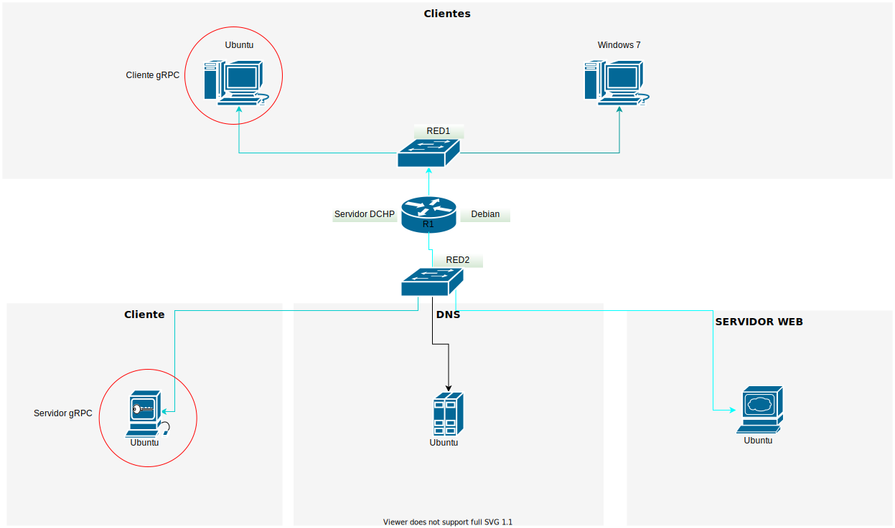

# Tutorial de gRPC en Go


Siguiendo la topología creada en la asignación [práctica de redes de máquinas virtuales](Practica1_EntornoDeMaquinasVirtuales.md) 
<br>

## Prerequisitos
Antes de poder seguir este tutorial, debe tener lo siguiente instalado en su sistema:
- **Go**: Versión 1.14 o superior. 
 Para obtener instrucciones de instalación, consulte La documentación de Go [Descarga e instalación](https://golang.org/doc/install "Download and install").

- **Protocol Buffer**: Versión 3.
Para obtener instrucciones de instalación, consulte la instalación de [Potocol Buffer](https://grpc.io/docs/protoc-installation/ "Potocol Buffer Installation") de gRPC o a la página de [Protocol Buffer](https://developers.google.com/protocol-buffers "Protocol Buffer").
<br>

## Ejecutar el ejemplo
Para ejecutar el ejemplo, descargue el código y vaya al directorio contenedor..

Primero inicie el servidor grpc con:

`$ go run sever/server.go`

Esto iniciará el servidor grpc escuchando en el puerto 9000

A continuación, ejecute el cliente grpc con:

`$ go run client/client.go`

Verá la siguiente salida:

```
2021/03/07 15:04:39 Respuesta del servidor: Hola gRPC Client desde el servidor!
```

y en el servidor verá: 

```
gRPC Server
El servidor gRPC ahora escucha en el puerto 9000
2021/03/07 15:04:39 Mensaje recibido de: gRPC Client
```
<br>

## Construyendo el ejemplo

Primero tenemos que inicializar los módulos go, utilizar cualquier nombre que desee, en este caso vamos a utilizar "grpcTutorial":

`$ go mod init grpcTutorial`

<br>

#### Plugins de Go para el Protocol Compiler

Necesitamos instalar los próximos plugins go para el protocol compiler y gRPC

Antes de instalar habilitamos el modo de módulo con:

`$ export GO111MODULE=on`

A continuación, instale lo siguiente: 

1. Instalar protoc-gen-go

	`$ go get google.golang.org/protobuf/cmd/protoc-gen-go`

2. Instalar protoc-gen-go-grpc

	`$ go get google.golang.org/grpc/cmd/protoc-gen-go-grpc `

3. Instalar grpc

	`$ go get google.golang.org/grpc`
	
<br>

Por último, actualiza tu `PATH` para que el `protoc` pueda encontrar los plugins:

`$ export PATH="$PATH:$(go env GOPATH)/bin"`

<br>

### Definir un servicios gRPC

Primero tenemos que definir el servicio gRPC y los tipos de solicitud y respuesta mediante búferes de protocolo.
<br>

#### Crear el archivo .proto 

Crear un archivo llamado `chat.proto`:

```go
// Definición de la versión de protocolo
syntax = "proto3";

// Definición del paquete
package chat;

// Definición del mensaje a enviar y recibir
message MessageRequest {
	string name = 1;
}

message MessageReply {
	string body = 1;
}

// Definición del ChatService
service ChatService {
	// Recibe un mensaje y devuelve un mensaje
	rpc SendMessage(MessageRequest) returns (MessageReply) {}
}
```

<br>

#### Generar código gRPC
Crear un nuevo directorio llamado `chatserver`,  este contendrá el código generado por `protoc`

`$ mkdir chatserver`


Para poder usar el servicio, necesita compilar el archivo `.proto`, lo hacemos usando` protocol` con el siguiente comando:

``$ protoc --go-grpc_out=require_unimplemented_servers=false:./chatserver/ --go_out=./chatserver/ chat.proto``

Esto generará `chat.pb.go` y `chat_grpc.pb.go` que son utilizados por el servidor grpc.

<br>

### Crear un servidor gRPC

Dentro de `chatserver` crear un nuevo fichero llamado `chat.go`

`touch chatserver/chat.go`

En este archivo implementaremos los servicios que definimos previamente en el fichero `chat.proto`:

```go
// Definición del paquete Chat
package chat

// Importaciones
import (
	"context"
	"log"
)

// Definición de la estructura del servidor
type Server struct {
}

// Implementación de la función SendMessage
func (s *Server) SendMessage(ctx context.Context, in *MessageRequest) (*MessageReply, error) {
	log.Printf("Mensaje recibido de: %s", in.GetName())
	return &MessageReply{Body: "Hola " + in.GetName() + " desde el servidor!"}, nil
}
```
<br>

### Crear un servidor Go

Para usar el servicio, necesitamos crear un servidor simple con go.

Crear un nuevo directorio llamado `server`

`$ mkdir server`

y dentro crear un nuevo archivo go llamado `server.go`

`touch server/server.go`

En este archivo vamos a definir un servidor gRPC usando go:

```go
// Definición del paquete main
package main

// Importaciones
import (
	"fmt"
	"log"
	"net"

	chat "grpcTutorial/chatserver"

	"google.golang.org/grpc"
)

// Definición de Main
func main() {
	println("gRPC Server")

	// Definición del puerto de escucha, en este caso el puerto 9000
	lis, err := net.Listen("tcp", fmt.Sprintf(":%d", 9000))
	if err != nil {
		log.Fatalf("No escuchó: %v", err)
	}

	println("El servidor gRPC ahora escucha en el puerto 9000")

	// Nueva instancia del servidor gRPC
	grpcServer := grpc.NewServer()

	// Registro del servicio con el servidor gRPC
	s := chat.Server{}
	chat.RegisterChatServiceServer(grpcServer, &s)

	// Llamamos a Serve() para iniciar el servicio
	if err := grpcServer.Serve(lis); err != nil {
		log.Fatalf("No se pudo servir: %s", err)
	}
}
```

<br>

Si intenta ejecutar el servidor, debería ver la siguiente salida:

```
$ go run server/server.go
gRPC Server
gRPC Server now listening on port 9000
```

<br>

### Crear cliente gRPC
Por último, necesitamos crear un cliente gRPC para consumir el servicio

Crear un nuevo directorio llamado `client`

`$ mkdir client`

y dentro crear un nuevo fichero llamado `client.go`

`touch client/client.go`

En este fichero vamos a definiri un código gRPC stub:

```go
// Definición del paquete
package main

// Importaciones
import (
	"context"
	"log"

	chat "grpcTutorial/chatserver"

	"google.golang.org/grpc"
)

// Definición de main
func main() {

	//Creamos un nuevo Cliente y asignamos credenciales usando grpc.Dial
	//Asignamos el puerto donde está escuchando el servidor, en este caso el puerto 9000
	var conn *grpc.ClientConn
	conn, err := grpc.Dial("192.168.2.4:9000", grpc.WithInsecure())
	if err != nil {
		log.Fatalf("No conecté: %s", err)
	}
	defer conn.Close()

	//Creación de Stub
	c := chat.NewChatServiceClient(conn)

	//Llamada al método de servicio, enviamos un MessageRequest y recibimos una respuesta con MessageReply
	response, err := c.SendMessage(context.Background(), &chat.MessageRequest{Name: "Cliente gRPC"})
	if err != nil {
		log.Fatalf("Error al llamar a SendMessage: %s", err)
	}
	log.Printf("Respuesta del servidor: %s", response.Body)
}
```

<br>

### Probar el cliente

Primero inicie el servidor:

`$ go run sever/server.go`

A continuación, ejecute el cliente con:

`$ go run client/client.go`

verá la siguiente salida:

```
2021/03/07 15:04:39 Respuesta del servidor: Hola gRPC Client desde el servidor!
```
y en el servidor verá: 

```
gRPC Server
El servidor gRPC ahora escucha en el puerto 9000
2021/03/07 15:04:39 Mensaje recibido de: gRPC Client
```

¡Felicitaciones! ahora tiene un servidor gRPC y un Cliente usando Go.

<br>

## Advertencias de importaciones 
Si recibe alguna advertencia o error de importación, intente ejecutar: 

`$ go mod tidy`